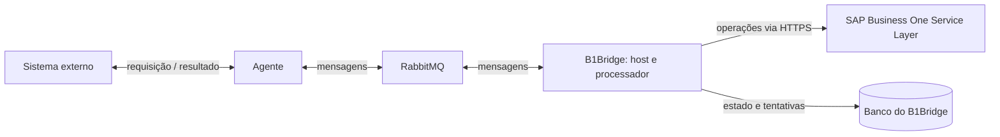

# B1Bridge

[](https://github.com/Kauec16/B1Bridge/actions/workflows/ci.yml)
[](https://dotnet.microsoft.com/)

Gateway de integração com o SAP Business One, desenvolvido em .NET 10. O objetivo é receber solicitações de sistemas externos, processá-las de forma assíncrona e manter um histórico consultável das operações e dos resultados.

As origens podem ser APIs, aplicações internas, e-commerces, CRMs ou marketplaces. O foco do B1Bridge é a integração com o SAP Business One Service Layer; os sistemas de origem se comunicam por meio de um agente.

> **Estado atual:** este repositório contém a fundação da solução e a integração contínua. Mensageria, agente, persistência, operações SAP e testes automatizados ainda serão implementados. Não há fluxo de integração funcional nesta versão.

## O que já existe

| Capacidade | Situação nesta base |
| --- | --- |
| Solução .NET 10 com quatro camadas | Implementada |
| Host ASP.NET Core e documento OpenAPI em desenvolvimento | Implementados |
| GitHub Actions para restore, build e execução de testes | Configurado; ainda não há projetos de teste |
| Endpoints de negócio e health checks | Planejados |
| Modelo de operação, persistência e reprocessamento | Planejados |
| RabbitMQ, consumidores e agente | Planejados |
| Adaptador do SAP Business One Service Layer | Planejado |

Os exemplos do template, incluindo `WeatherForecast`, já foram removidos. A estrutura atual também não contém classes ou testes de exemplo.

## Arquitetura prevista



O agente será instalado próximo do sistema de origem. Ele publicará solicitações no RabbitMQ e receberá resultados para entregá-los ao sistema externo. Apenas o B1Bridge terá acesso ao SAP e às suas credenciais.

O banco do B1Bridge guardará o estado técnico da integração. O SAP continuará responsável pelos dados de negócio. O diagrama representa o destino arquitetural, não componentes já disponíveis nesta versão.

Os limites entre os componentes, a estratégia de confiabilidade e as decisões ainda abertas estão no [guia de arquitetura](docs/architecture.md).

## Organização da solução

```text
B1Bridge/
├── .github/workflows/ci.yml
├── B1Bridge.slnx
├── README.md
├── docs/
│   ├── architecture.md
│   └── roadmap.md
└── src/
    ├── B1Bridge.Api/
    ├── B1Bridge.Application/
    ├── B1Bridge.Domain/
    └── B1Bridge.Infrastructure/
```

| Projeto | Responsabilidade |
| --- | --- |
| `B1Bridge.Api` | Host HTTP, configuração e composição das dependências. Futuramente, endpoints administrativos e inicialização do processamento em segundo plano. |
| `B1Bridge.Application` | Casos de uso e contratos das capacidades externas necessárias à aplicação. |
| `B1Bridge.Domain` | Regras de integração e transições de estado independentes de infraestrutura. |
| `B1Bridge.Infrastructure` | Implementações de persistência, mensageria e comunicação com o SAP. |

As referências atuais são `Api → Application`, `Api → Infrastructure`, `Infrastructure → Application` e `Application → Domain`. O domínio não referencia os demais projetos nem pacotes de infraestrutura.

## Executar localmente

Pré-requisito: **.NET SDK 10.0.x**. Um editor ou IDE compatível com esse SDK é opcional. A versão atual não exige RabbitMQ, banco de dados nem acesso ao SAP.

Na raiz do repositório:

```bash
dotnet restore B1Bridge.slnx
dotnet build B1Bridge.slnx --configuration Release --no-restore
dotnet run --project src/B1Bridge.Api/B1Bridge.Api.csproj --launch-profile http
```

O perfil `http` usa `http://localhost:5253` e o ambiente `Development`. Com a aplicação em execução, consulte o documento OpenAPI em:

```text
http://localhost:5253/openapi/v1.json
```

O documento ainda não apresenta operações de negócio. A rota `/` não possui página ou endpoint mapeado; um retorno `404` nela é esperado. Também não há interface Swagger UI configurada.

As portas e os perfis locais estão em [launchSettings.json](src/B1Bridge.Api/Properties/launchSettings.json). O OpenAPI é exposto apenas no ambiente de desenvolvimento.

## Validação e CI

A [pipeline de CI](.github/workflows/ci.yml) executa restore, build em Release e `dotnet test`. Ela é acionada em pushes para `main`, `chore/**` e `feature/**`, e em pull requests destinados à `main`.

Para executar os mesmos comandos localmente:

```bash
dotnet restore B1Bridge.slnx
dotnet build B1Bridge.slnx --configuration Release --no-restore
dotnet test B1Bridge.slnx --configuration Release --no-build --verbosity normal
```

A etapa de testes está preparada, mas **ainda não existe suíte de testes nesta solução**. Uma execução bem-sucedida dessa etapa não representa cobertura de comportamento. Os primeiros testes acompanharão as regras do ciclo de vida das operações.

## Configuração e segurança

As configurações do host ficam em `src/B1Bridge.Api/appsettings.json` e `appsettings.Development.json`. Atualmente, não há configuração de integração SAP, RabbitMQ ou banco de dados.

Quando esses adaptadores forem adicionados, credenciais deverão ser fornecidas por User Secrets no desenvolvimento, variáveis de ambiente ou pelo gerenciador de segredos da implantação. Não adicione senhas, tokens, certificados privados ou payloads reais de clientes ao repositório.

A autenticação do agente e as permissões no broker serão independentes do login do SAP. Esses controles ainda precisam ser implementados.

## Próximas entregas

A próxima entrega proposta é o ciclo de vida de uma operação de integração, com suas transições de estado e testes. Depois virão persistência, contratos de mensagem, transporte RabbitMQ e a primeira operação SAP.

O [roadmap](docs/roadmap.md) descreve a ordem sugerida e os critérios de conclusão. Funcionalidades existentes em experimentos ou branches antigas só passam a ser consideradas disponíveis quando incorporadas e verificadas nesta base.

## Desenvolvimento

- Entregar mudanças pequenas, com uma responsabilidade clara por pull request.
- Introduzir projetos, abstrações e padrões quando houver um caso de uso concreto.
- Manter detalhes de HTTP no host e detalhes de SAP, banco e broker em Infrastructure.
- Testar regras e comportamentos relevantes; evitar testes que apenas reproduzem o template.
- Atualizar a documentação junto da implementação que altera o comportamento.
- Usar commits descritivos, como `feat(operations): add operation lifecycle`, `test(domain): cover invalid state transitions` e `docs: clarify integration architecture`.

Esta documentação descreve o código disponível neste repositório e a evolução pretendida. As capacidades planejadas não são garantias de funcionamento em produção.
