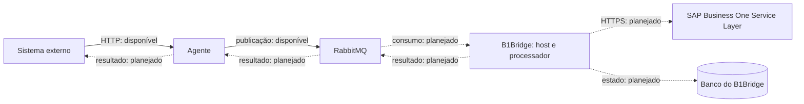

# B1Bridge

[](https://github.com/Kauec16/B1Bridge/actions/workflows/ci.yml)
[](https://dotnet.microsoft.com/)

Gateway de integração com o SAP Business One, desenvolvido em .NET 10. O objetivo é receber solicitações de sistemas externos, processá-las de forma assíncrona e manter um histórico consultável das operações e dos resultados.

As origens podem ser APIs, aplicações internas, e-commerces, CRMs ou marketplaces. O foco do B1Bridge é a integração com o SAP Business One Service Layer; os sistemas de origem se comunicam por meio de um agente.

> **Estado atual:** a solução contém a fundação, a integração contínua e o agente HTTP que publica solicitações no RabbitMQ, com contratos compartilhados e testes unitários. Consumidores, persistência, operações SAP e retorno de resultados ainda serão implementados. O fluxo disponível termina na publicação da solicitação no broker.

## O que já existe

| Capacidade | Situação nesta base |
| --- | --- |
| Solução .NET 10 com quatro camadas | Implementada |
| Host ASP.NET Core e documento OpenAPI em desenvolvimento | Implementados |
| Agente HTTP e publicação de solicitações no RabbitMQ | Implementados |
| Contratos `IntegrationRequest`, `IntegrationResult` e `RouteInfo` | Disponíveis; o fluxo de resultados ainda é planejado |
| GitHub Actions para restore, build e execução de testes | Configurado |
| Testes do agente | Controller e inicialização do publisher, sem broker real |
| Endpoints administrativos e health checks do B1Bridge | Planejados |
| Modelo de operação, persistência e reprocessamento | Planejados |
| Consumo de solicitações e retorno de resultados | Planejados |
| Adaptador do SAP Business One Service Layer | Planejado |

Os exemplos do template, incluindo `WeatherForecast`, já foram removidos. A estrutura atual também não contém classes ou testes de exemplo.

## Arquitetura e estágio atual



O agente recebe solicitações HTTP, preserva método, caminho, query e JSON em um envelope e o publica no RabbitMQ. Ele retorna `202 Accepted` após a publicação confirmada pelo broker. Esse aceite não indica execução no SAP. O consumo das solicitações e a entrega dos resultados ao sistema externo ainda serão implementados. Apenas o B1Bridge terá acesso ao SAP e às suas credenciais.

O banco do B1Bridge guardará o estado técnico da integração. O SAP continuará responsável pelos dados de negócio. As setas tracejadas do diagrama representam capacidades planejadas.

Os limites entre os componentes, a estratégia de confiabilidade e as decisões ainda abertas estão no [guia de arquitetura](docs/architecture.md).

## Organização da solução

```text
B1Bridge/
├── .github/workflows/ci.yml
├── B1Bridge.slnx
├── README.md
├── docs/
│   ├── architecture.md
│   └── roadmap.md
├── src/
│   ├── B1Bridge.Agent/
│   ├── B1Bridge.Api/
│   ├── B1Bridge.Application/
│   ├── B1Bridge.Contracts/
│   ├── B1Bridge.Domain/
│   └── B1Bridge.Infrastructure/
└── tests/
    └── B1Bridge.Agent.Tests/
```

| Projeto | Responsabilidade |
| --- | --- |
| `B1Bridge.Agent` | Host HTTP de entrada e publicação de solicitações no RabbitMQ. |
| `B1Bridge.Api` | Host HTTP, configuração e composição das dependências. Futuramente, endpoints administrativos e inicialização do processamento em segundo plano. |
| `B1Bridge.Application` | Casos de uso e contratos das capacidades externas necessárias à aplicação. |
| `B1Bridge.Contracts` | Envelopes compartilhados de requisição, resultado e rota. |
| `B1Bridge.Domain` | Regras de integração e transições de estado independentes de infraestrutura. |
| `B1Bridge.Infrastructure` | Implementações de persistência, mensageria e comunicação com o SAP. |
| `B1Bridge.Agent.Tests` | Testes unitários da recepção HTTP, dos identificadores, da validação de JSON e da inicialização do publisher. |

As referências entre as camadas são `Api → Application`, `Api → Infrastructure`, `Infrastructure → Application` e `Application → Domain`. O agente referencia `Contracts`, e os testes referenciam o agente e os contratos. O domínio não referencia os demais projetos nem pacotes de infraestrutura.

## Executar localmente

Pré-requisito: **.NET SDK 10.0.x**. Um editor ou IDE compatível com esse SDK é opcional. Para publicar solicitações pelo agente, é necessário um RabbitMQ acessível. O host `B1Bridge.Api` e os testes unitários podem executar sem broker. Ainda não é necessário banco de dados nem acesso ao SAP.

Na raiz do repositório:

```bash
dotnet restore B1Bridge.slnx
dotnet build B1Bridge.slnx --configuration Release --no-restore
dotnet run --project src/B1Bridge.Api/B1Bridge.Api.csproj --launch-profile http
```

O perfil `http` usa `http://localhost:5253` e o ambiente `Development`. Com a aplicação em execução, consulte o documento OpenAPI em:

```text
http://localhost:5253/openapi/v1.json
```

O documento ainda não apresenta operações de negócio. A rota `/` não possui página ou endpoint mapeado; um retorno `404` nela é esperado. Também não há interface Swagger UI configurada.

As portas e os perfis locais estão em [launchSettings.json](src/B1Bridge.Api/Properties/launchSettings.json). O OpenAPI é exposto apenas no ambiente de desenvolvimento.

### Executar o agente

Com o RabbitMQ disponível e a configuração abaixo ajustada, execute:

```bash
dotnet run --project src/B1Bridge.Agent/B1Bridge.Agent.csproj --launch-profile http
```

O perfil `http` do agente usa `http://localhost:9898`. O perfil `https` usa também `https://localhost:9899`, conforme seu [launchSettings.json](src/B1Bridge.Agent/Properties/launchSettings.json). O agente aceita `GET`, `POST`, `PUT`, `PATCH` e `DELETE` em caminhos genéricos. Exemplo de requisição:

```http
POST http://localhost:9898/CriacaoItem/A123?source=integration
Content-Type: application/json
X-Correlation-Id: corr-456
Idempotency-Key: external-request-789

{
  "name": "Produto teste"
}
```

`/CriacaoItem/A123` é um caminho de exemplo transportado no envelope; ainda não está associado a uma operação SAP. A resposta de aceite contém `operationId`, `correlationId` e `status: "Accepted"`. O agente gera um `operationId` por requisição e gera os identificadores ausentes; a chave de idempotência é apenas transportada, sem deduplicação. Corpo vazio vira `{}`; JSON inválido retorna `400` sem publicação.

## Validação e CI

A [pipeline de CI](.github/workflows/ci.yml) executa restore, build em Release e `dotnet test`. Ela é acionada em pushes para `main`, `chore/**` e `feature/**`, e em pull requests destinados à `main`.

Para executar os mesmos comandos localmente:

```bash
dotnet restore B1Bridge.slnx
dotnet build B1Bridge.slnx --configuration Release --no-restore
dotnet test B1Bridge.slnx --configuration Release --no-build --verbosity normal
```

`B1Bridge.Agent.Tests` cobre a construção do envelope e o retorno `202`, a geração de identificadores quando faltam headers e a rejeição de JSON inválido sem publicação. Os testes do controller usam um publisher em memória. Os testes do publisher cobrem a inicialização concorrente e a falha ao preparar a topologia, com substitutos para a conexão e o canal. A suíte não verifica um broker RabbitMQ real, o transporte HTTP completo nem uma integração com SAP. Testes das regras de domínio e de integração com infraestrutura acompanharão as próximas entregas.

## Configuração e segurança

As configurações de cada host ficam em seus arquivos `appsettings.json` e `appsettings.Development.json`. O agente lê a seção `RabbitMq`; a configuração de desenvolvimento usa `localhost:5672`, usuário e senha padrão `guest` e `Uri` vazia. Esses valores servem para um broker local. Ainda não há configuração de integração SAP ou banco de dados.

| Opção `RabbitMq` | Padrão / uso |
| --- | --- |
| `Uri` | Vazia; quando preenchida, tem prioridade sobre host, porta, usuário e senha. Aceita uma URI de conexão `amqp://` ou `amqps://`. |
| `Host`, `Port` | `localhost`, `5672`. |
| `UserName`, `Password` | `guest`, `guest`, para desenvolvimento local. |
| `Exchange` | `b1bridge.integration`, declarada como direct e durável. |
| `Queue` | `b1bridge.integration.requests`, declarada como durável. |
| `RoutingKey` | `integration.requested`, usada no binding e na publicação. |

Para sobrescrever opções com variáveis de ambiente, use dois sublinhados, por exemplo `RabbitMq__Host`, `RabbitMq__Password` ou `RabbitMq__Uri`. Em PowerShell, um exemplo sem credenciais reais é:

```powershell
$env:RabbitMq__Host = "localhost"
$env:RabbitMq__Port = "5672"
dotnet run --project src/B1Bridge.Agent/B1Bridge.Agent.csproj --launch-profile http
```

O projeto do agente já possui `UserSecretsId`. No desenvolvimento, uma URI externa pode ser configurada com o comando abaixo, substituindo os marcadores pelos valores do ambiente:

```bash
dotnet user-secrets set "RabbitMq:Uri" "amqps://<usuario>:<senha>@<host>:5671/<vhost>" --project src/B1Bridge.Agent/B1Bridge.Agent.csproj
```

Credenciais devem ser fornecidas por User Secrets no desenvolvimento, variáveis de ambiente ou pelo gerenciador de segredos da implantação. Não adicione senhas reais, tokens, certificados privados ou payloads reais de clientes ao repositório.

O agente ainda não autentica as requisições HTTP recebidas. A autenticação de entrada e as políticas de autorização e isolamento no broker permanecem pendentes; serão independentes do login do SAP.

## Próximas entregas

A próxima entrega proposta é o ciclo de vida de uma operação de integração, com suas transições de estado e testes. Depois virão persistência, consumo das mensagens, versionamento dos contratos, outbox e a primeira operação SAP. O agente atual fornece o ponto de partida para a entrada HTTP e a publicação no broker.

O [roadmap](docs/roadmap.md) descreve a ordem sugerida e os critérios de conclusão. Funcionalidades existentes em experimentos ou branches antigas só passam a ser consideradas disponíveis quando incorporadas e verificadas nesta base.

## Desenvolvimento

- Entregar mudanças pequenas, com uma responsabilidade clara por pull request.
- Introduzir projetos, abstrações e padrões quando houver um caso de uso concreto.
- Manter detalhes de HTTP nos hosts, a publicação do agente em seu adaptador e os futuros adaptadores SAP, banco e broker do B1Bridge em Infrastructure.
- Testar regras e comportamentos relevantes; evitar testes que apenas reproduzem o template.
- Atualizar a documentação junto da implementação que altera o comportamento.
- Usar commits descritivos, como `feat(operations): add operation lifecycle`, `test(domain): cover invalid state transitions` e `docs: clarify integration architecture`.

Esta documentação descreve o código disponível neste repositório e a evolução pretendida. As capacidades planejadas não são garantias de funcionamento em produção.
