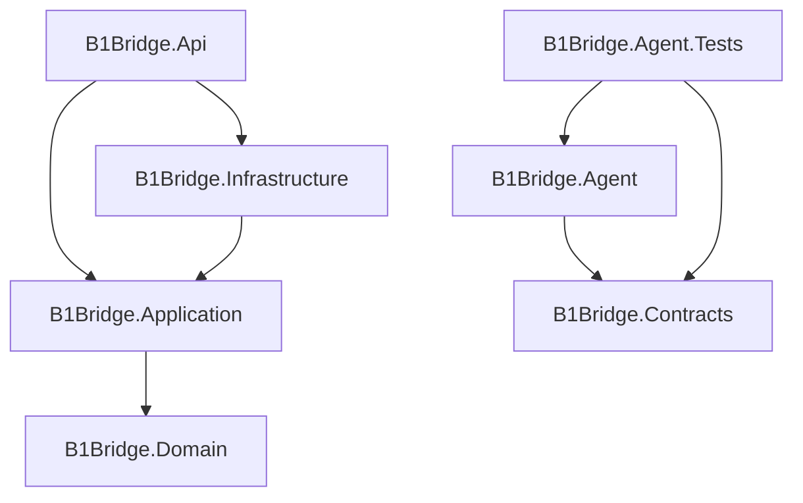

# Arquitetura do B1Bridge

[Voltar ao README](../README.md)

## Escopo e estado atual

O B1Bridge tem foco em integrações com o SAP Business One Service Layer. Qualquer sistema externo autorizado poderá originar solicitações por meio de um agente; marketplace é apenas um exemplo de origem.

A solução atual contém as quatro camadas .NET 10 do B1Bridge, o agente HTTP, contratos compartilhados, testes unitários do agente e a CI. O agente já publica solicitações no RabbitMQ. Consumidores, persistência, cliente SAP e retorno de resultados ainda serão implementados.

### Fluxo disponível

O controller do agente recebe `GET`, `POST`, `PUT`, `PATCH` e `DELETE`, valida a sintaxe do JSON e monta um `IntegrationRequest` com método, caminho, query e payload. Ele gera `operationId`, preserva `X-Correlation-Id` e `Idempotency-Key` quando fornecidos e preenche os identificadores ausentes. O transporte da chave ainda não implementa idempotência.

O publisher declara uma exchange direct durável, uma fila durável e o binding configurado, publica mensagens persistentes com `mandatory` e aguarda a confirmação do broker. O controller retorna `202 Accepted` após essa publicação. Essa confirmação não representa persistência de uma operação no banco do B1Bridge nem execução no SAP.

`IntegrationResult` já existe como contrato, mas nenhum componente publica, consome ou entrega resultados nesta versão. O agente também não autentica a entrada HTTP. Os testes do controller usam um publisher em memória e cobrem o envelope/aceite, os identificadores e a rejeição de JSON inválido. Os testes do publisher cobrem a inicialização concorrente e a falha na preparação da topologia com substitutos para a conexão e o canal; não validam um broker real.

## Limites dos componentes

| Componente | Responsabilidade prevista | Limite |
| --- | --- | --- |
| Sistema externo | Originar solicitações e receber o resultado assíncrono. | Não precisa conhecer sessões ou credenciais do Service Layer. |
| Agente | Receber solicitações autorizadas, publicar mensagens e entregar resultados correlacionados. | Não acessa o SAP; sua autenticação é independente da autenticação SAP. |
| RabbitMQ | Transportar requisições e resultados entre os componentes. | Não substitui o banco de operações. |
| B1Bridge | Validar, registrar e processar operações, acompanhar tentativas e publicar resultados. | É o único componente desta integração que acessa o SAP. |
| Banco do B1Bridge | Manter o estado técnico durável, o histórico e os registros de publicação pendente. | Não substitui os dados de negócio do ERP. |
| SAP Business One | Manter clientes, itens, documentos e outros dados de negócio. | Seu banco não será usado como repositório técnico do gateway. |

O agente fica próximo do sistema externo. O B1Bridge precisa de conectividade com o Service Layer e poderá ser instalado no ambiente do cliente. A hospedagem do broker, local ou gerenciada, será definida conforme a implantação.

O desenho previsto usa um processador em segundo plano no host do B1Bridge para consumir as mensagens. Os endpoints HTTP terão finalidade técnica ou administrativa. A entrada de negócio por HTTP diretamente no B1Bridge não faz parte do fluxo alvo definido até aqui.

## Camadas e dependências

- **Api:** compõe a aplicação, configura o host e inicializa os serviços necessários. Não concentra regras de operação ou chamadas SAP.
- **Application:** coordena os casos de uso e define os contratos de persistência, execução externa e mensageria que esses casos exigirem.
- **Domain:** protege regras de integração, invariantes e transições válidas de estado. Não conhece HTTP, RabbitMQ, banco ou SDK do SAP.
- **Infrastructure:** implementa os adaptadores técnicos. Consumidores traduzem mensagens em chamadas à aplicação, evitando que as regras do ciclo de vida fiquem presas ao transporte.
- **Agent:** recebe HTTP e publica solicitações através de `IRabbitMqPublisher`; seu adaptador RabbitMQ pertence ao próprio agente e não depende do host B1Bridge.
- **Contracts:** contém `IntegrationRequest`, `IntegrationResult` e `RouteInfo`, sem dependência de RabbitMQ ou SAP. O contrato de resultado ainda não possui fluxo implementado.

A estrutura segue Clean Architecture. Conceitos de DDD serão usados quando houver regras que justifiquem seu uso. O projeto compartilhado de contratos e os testes do agente já acompanham a publicação HTTP/RabbitMQ; os testes de domínio e de infraestrutura serão introduzidos junto dos respectivos comportamentos.

## Ciclo de uma operação: desenho pretendido

Receber uma solicitação e concluir uma operação SAP são momentos distintos. O sistema de origem deverá conseguir distinguir uma requisição aceita de uma integração concluída.

### Recepção durável

1. O agente valida a requisição e atribui ou propaga os identificadores acordados no contrato.
2. A publicação no RabbitMQ usa confirmação do broker. Essa confirmação, isoladamente, não significa que o SAP processou a operação.
3. O consumidor do B1Bridge valida o envelope e tenta registrar a operação com uma chave de idempotência protegida por uma restrição de unicidade no banco.
4. O registro da operação e a intenção de agendar seu processamento são persistidos de forma consistente. Quando o agendamento depender de outra mensagem, a proposta é usar uma outbox transacional: registros gravados na mesma transação e publicados posteriormente.
5. O consumidor confirma a mensagem recebida depois do commit durável. A recuperação após reinício precisa encontrar e continuar o trabalho pendente.

O formato e o escopo da chave de idempotência ainda serão definidos. A comparação deverá considerar também o sistema de origem. Reutilizar uma chave com conteúdo diferente deverá produzir um conflito explícito.

### Processamento e resultado

1. O processador obtém a operação pendente com controle de concorrência para impedir execuções simultâneas indevidas.
2. A aplicação valida a transição de estado e registra o início da tentativa.
3. O adaptador executa a operação no SAP Service Layer.
4. O estado da tentativa, o resultado e a intenção de publicar a resposta são persistidos juntos, usando a outbox quando necessário.
5. O resultado é publicado com os identificadores originais. O agente o correlaciona e entrega ao sistema de origem conforme seu contrato.

Os envelopes iniciais e a fila de solicitações já existem. O versionamento das mensagens, os nomes finais dos estados, a topologia de resultados e as políticas de retenção serão definidos nas respectivas entregas. Não existe uma transação única abrangendo banco, RabbitMQ e SAP.

## Falhas, duplicatas e reprocessamento

| Situação | Comportamento a implementar e testar |
| --- | --- |
| Entrega repetida da mesma solicitação | Recuperar a operação existente e evitar criar uma nova execução indevida. |
| Falha temporária de infraestrutura | Reagendar com espera e limite de tentativas, preservando o histórico. |
| Erro de validação ou regra de negócio do SAP | Registrar o erro e permitir uma ação corretiva; evitar repetição automática sem mudança de condição. |
| Envelope inválido | Isolar a mensagem com motivo rastreável, sem bloquear indefinidamente o consumo. |
| Tentativas esgotadas | Tornar a falha consultável e encaminhar a mensagem para a fila de falhas conforme a política definida. |
| Timeout após enviar uma criação ao SAP | Tratar o resultado como incerto e reconciliar com o SAP antes de repetir uma operação que possa duplicar documentos. |
| Reinício após gravar o resultado, antes de publicá-lo | Retomar a publicação a partir da outbox. Consumidores de resultados também precisam tolerar duplicatas. |

Uma chave local de idempotência não garante, sozinha, uma única criação no SAP. A primeira operação SAP precisará definir uma forma de identificar ou reconciliar o efeito externo em caso de resposta perdida.

Reprocessamento manual deverá preservar a identidade e as tentativas da operação. As permissões, os estados elegíveis e o tratamento de payload corrigido serão decisões explícitas do caso de uso.

## Persistência e segurança

A base própria deverá guardar operações, estado atual, tentativas, datas, correlação, erros e resultados. Os JSONs de entrada, saída e resposta poderão ser registrados para diagnóstico com mascaramento, acesso controlado e retenção definida. Senhas e tokens não devem ser incluídos nesses registros.

SQLite é o ponto de partida proposto para desenvolvimento local. A escolha do banco de produção dependerá de concorrência, implantação, backup e operação. Abstrações ajudam a separar responsabilidades, mas a troca de provedor ainda exigirá validação de transações, constraints e migrations.

As migrations técnicas pertencerão ao banco do B1Bridge. Campos ou tabelas adicionais no SAP só serão avaliados quando uma necessidade de negócio ou de correlação com a operação SAP justificar seu uso.

A conexão do agente com o broker aceita configuração por host/porta/usuário/senha ou por URI, incluindo `amqps://`. A URI tem prioridade quando preenchida. A configuração local e as formas de fornecer segredos estão no [README](../README.md#configuração-e-segurança).

A implantação ainda deverá definir autenticação própria para a entrada HTTP do agente, permissões mínimas no broker e isolamento entre clientes. Credenciais do SAP ficarão exclusivamente no ambiente do B1Bridge, fornecidas por mecanismos de configuração seguros.

## Decisões ainda abertas

- Hospedagem do RabbitMQ, evolução da topologia inicial e isolamento de mensagens por cliente/agente.
- Autenticação da entrada HTTP e contrato de entrega de resultados ao sistema externo.
- Versionamento das mensagens, identificadores e escopo da idempotência.
- Primeira operação SAP e reconciliação de resultados incertos.
- Provedor de persistência para produção e política de retenção.
- Limites de retry, encaminhamento de falhas e autorização para reprocessar.

Essas decisões deverão acompanhar entregas pequenas e verificáveis, conforme o [roadmap](roadmap.md).
